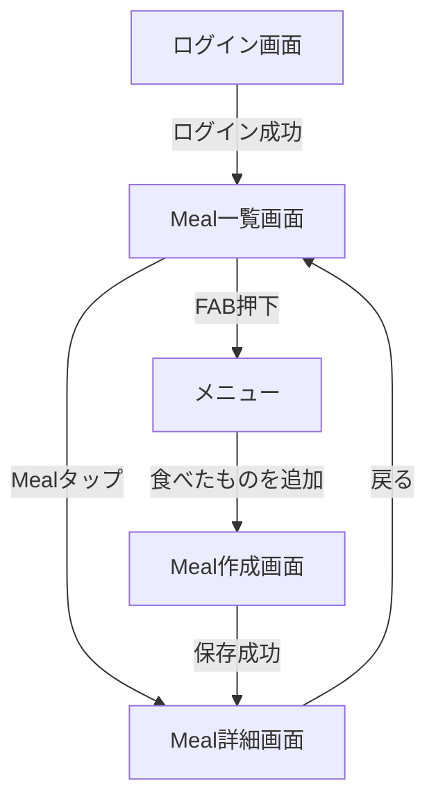
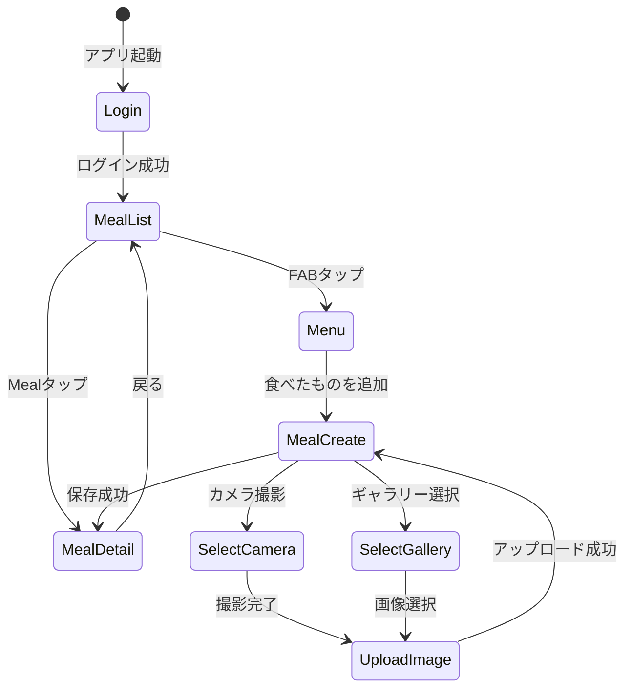

# Meal Manager アプリ 画面仕様書

## 📱 画面一覧

| 画面名 | 説明 | 状態 |
|-------|------|------|
| ログイン画面 | Auth0認証によるログイン | ✅ 実装済み |
| Meal一覧画面 | 食事記録の一覧表示 | 🔲 未実装 |
| Meal詳細画面 | 食事記録の詳細表示 | 🔲 未実装 |
| Meal作成画面 | 新しい食事記録の作成 | 🔲 未実装 |

---

## 🔄 画面遷移フロー



---

## 1. ログイン画面

### 状態
✅ **実装済み**

### 概要
Auth0を使用したブラウザベースのOAuth認証を提供

### UI要素
- アプリタイトル
- ログインボタン
- ローディングインジケーター
- エラーメッセージ表示エリア

### 動作
1. ログインボタンタップ → Auth0ログイン画面へ遷移
2. 認証成功 → Meal一覧画面へ遷移
3. 認証失敗 → エラーメッセージ表示

### API連携
- なし（Auth0 SDKを使用）

### 実装ファイル
- `feature/auth/ui/LoginScreen.kt`
- `feature/auth/viewmodel/LoginViewModel.kt` (androidMain)

---

## 2. Meal一覧画面

### 状態
🔲 **未実装**

### 概要
ユーザーが登録した食事記録を2カラムのグリッド形式で一覧表示

### UI要素

#### レイアウト
- **グリッド形式**: 2カラム（LazyVerticalGrid）
- **各アイテム**:
  - 画像サムネイル（正方形）
  - 料理名（1-2行、省略表示）
  - 調理日時（"2025/11/09 12:00" 形式）
- **FloatingActionButton (FAB)**: 右下に配置

#### FABメニュー
FABタップで展開メニュー表示：
- 「食べたものを追加」ボタン

#### 状態表示
- **ローディング**: 中央にCircularProgressIndicator
- **エラー**: エラーメッセージとリトライボタン
- **空状態**: 「まだ食事が登録されていません」メッセージ + 追加ボタン
- **成功**: グリッドで食事一覧表示

### 動作

#### 初期表示
1. 画面表示時に自動的にAPI呼び出し（GET /meals）
2. ローディング表示
3. 取得成功 → グリッド表示
4. 取得失敗 → エラー表示

#### アイテムタップ
1. Mealアイテムをタップ
2. Meal詳細画面へ遷移（mealIdを渡す）

#### FABタップ
1. FABをタップ
2. 展開メニュー表示
3. 「食べたものを追加」タップ
4. Meal作成画面へ遷移

#### Pull-to-Refresh
1. 画面を下に引っ張る
2. 一覧を再取得

### API連携

#### GET /meal-manager-api/meals
**リクエスト:**
- ヘッダー: `Authorization: Bearer <token>`

**レスポンス:**
```json
{
  "meals": [
    {
      "mealId": "uuid",
      "dishName": "カレーライス",
      "cookedAt": "2025-11-09T12:00:00+09:00",
      "memo": "美味しかった",
      "imageId": "uuid",
      "imageUrl": "https://cdn.example.com/images/xxx.jpg",
      "recipeId": null
    }
  ]
}
```

### エラーハンドリング
- **401 Unauthorized**: トークン期限切れ → ログイン画面へ遷移
- **500 Server Error**: 「サーバーエラーが発生しました」表示 + リトライボタン
- **ネットワークエラー**: 「ネットワークに接続できません」表示 + リトライボタン

### 実装ファイル（予定）
- `feature/meal/ui/MealListScreen.kt`
- `feature/meal/ui/components/MealGridItem.kt`
- `feature/meal/viewmodel/MealListViewModel.kt` (androidMain)
- `feature/meal/model/MealListState.kt`
- `feature/meal/api/MealApi.kt`

---

## 3. Meal詳細画面

### 状態
🔲 **未実装**

### 概要
選択した食事記録の詳細情報を表示

### UI要素

#### レイアウト
- **画像**: 画面上部に大きく表示（横幅いっぱい、アスペクト比維持）
  - 画像なしの場合: プレースホルダー表示
- **料理名**: 大きなフォントで表示
- **調理日時**: 「2025年11月9日 12:00」形式で表示
- **メモ**: テキスト表示（複数行対応）
- **編集ボタン**: 将来実装用（現在は非表示）
- **削除ボタン**: 将来実装用（現在は非表示）

#### 状態表示
- **ローディング**: 中央にCircularProgressIndicator
- **エラー**: エラーメッセージと戻るボタン
- **成功**: 詳細情報表示

### 動作

#### 初期表示
1. mealIdを受け取る
2. API呼び出し（GET /meals/{mealId}）
3. ローディング表示
4. 取得成功 → 詳細表示
5. 取得失敗 → エラー表示

#### 戻るボタン
1. 戻るボタンタップ
2. Meal一覧画面へ遷移

### API連携

#### GET /meal-manager-api/meals/{mealId}
**リクエスト:**
- ヘッダー: `Authorization: Bearer <token>`
- パスパラメータ: `mealId` (UUID)

**レスポンス:**
```json
{
  "mealId": "uuid",
  "dishName": "カレーライス",
  "cookedAt": "2025-11-09T12:00:00+09:00",
  "memo": "美味しかった",
  "imageId": "uuid",
  "imageUrl": "https://cdn.example.com/images/xxx.jpg",
  "recipeId": null
}
```

### エラーハンドリング
- **403 Forbidden**: 「この食事にアクセスする権限がありません」
- **404 Not Found**: 「食事が見つかりませんでした」
- **500 Server Error**: 「サーバーエラーが発生しました」

### 実装ファイル（予定）
- `feature/meal/ui/MealDetailScreen.kt`
- `feature/meal/viewmodel/MealDetailViewModel.kt` (androidMain)
- `feature/meal/model/MealDetailState.kt`

---

## 4. Meal作成画面

### 状態
🔲 **未実装**

### 概要
新しい食事記録を作成するフォーム画面。画像アップロード機能を含む。

### UI要素

#### フォーム要素
1. **料理名入力**
   - TextField
   - プレースホルダー: 「料理名を入力」
   - 最大100文字
   - 必須（空白不可）
   - エラー表示: 「料理名を入力してください」

2. **調理日時入力**
   - DateTimePickerボタン
   - デフォルト: 現在日時
   - タップでDateTimePickerダイアログ表示
   - フォーマット: 「2025年11月9日 12:00」

3. **メモ入力**
   - TextField（複数行対応）
   - プレースホルダー: 「メモを入力（任意）」
   - 最大1000文字
   - オプション

4. **画像選択**
   - 画像プレビューエリア（未選択時はプレースホルダー）
   - 「カメラで撮影」ボタン
   - 「ギャラリーから選択」ボタン
   - 選択後はプレビュー表示 + 「変更」ボタン

5. **保存ボタン**
   - 画面下部に固定
   - バリデーションエラーがある場合は無効化
   - タップで保存処理実行

#### 状態表示
- **アイドル**: 通常のフォーム表示
- **画像アップロード中**: 画像エリアにローディング表示
- **保存中**: 保存ボタンがローディング状態
- **エラー**: エラーメッセージ表示（Snackbar）

### 動作

#### 画像選択フロー

##### カメラ撮影
1. 「カメラで撮影」ボタンタップ
2. カメラ権限チェック
   - 未許可 → 権限リクエスト
   - 拒否された → エラーメッセージ
3. カメラアプリ起動
4. 撮影完了 → 画像取得
5. 画像アップロード処理へ

##### ギャラリー選択
1. 「ギャラリーから選択」ボタンタップ
2. ストレージ権限チェック（Android 12以下）
3. ギャラリーアプリ起動
4. 画像選択 → 画像取得
5. 画像アップロード処理へ

#### 画像アップロード処理
1. **presignedURL取得**
   - API呼び出し: `GET /images/upload-url`
   - レスポンス: `{ imageId, presignedUrl }`

2. **S3アップロード**
   - `presignedUrl`にPUTリクエスト
   - Content-Type: image/jpeg
   - ボディ: 画像データ

3. **状態更新**
   - `imageId`を保持
   - プレビュー画像を表示
   - アップロード成功メッセージ（Snackbar）

4. **エラーハンドリング**
   - presignedURL取得失敗 → 「画像アップロードURLの取得に失敗しました」
   - S3アップロード失敗 → 「画像のアップロードに失敗しました」

#### 保存処理
1. **バリデーション**
   - 料理名が空でないか
   - 料理名が100文字以内か
   - メモが1000文字以内か

2. **API呼び出し**
   - `POST /meals`
   - リクエストボディ:
     ```json
     {
       "dishName": "カレーライス",
       "cookedAt": "2025-11-09T12:00:00Z",
       "memo": "美味しかった",
       "imageId": "uuid" // オプション
     }
     ```

3. **成功処理**
   - レスポンスから`mealId`を取得
   - Meal詳細画面へ遷移（mealIdを渡す）

4. **エラー処理**
   - 400 Bad Request → バリデーションエラーメッセージ表示
   - 500 Server Error → 「保存に失敗しました」

### API連携

#### 1. GET /meal-manager-api/images/upload-url
**リクエスト:**
- ヘッダー: なし（認証不要）

**レスポンス:**
```json
{
  "imageId": "uuid",
  "presignedUrl": "https://s3.amazonaws.com/upload-bucket/xxx?signature=..."
}
```

#### 2. PUT {presignedUrl}
**リクエスト:**
- ヘッダー: `Content-Type: image/jpeg`
- ボディ: 画像データ（バイナリ）

**レスポンス:**
- 200 OK（ボディなし）

#### 3. POST /meal-manager-api/meals
**リクエスト:**
- ヘッダー: `Authorization: Bearer <token>`
- ボディ:
  ```json
  {
    "dishName": "カレーライス",
    "cookedAt": "2025-11-09T12:00:00Z",
    "memo": "美味しかった",
    "imageId": "uuid"
  }
  ```

**レスポンス:**
```json
{
  "mealId": "uuid",
  "dishName": "カレーライス",
  "cookedAt": "2025-11-09T12:00:00+09:00",
  "memo": "美味しかった",
  "imageId": "uuid",
  "imageUrl": "https://cdn.example.com/images/xxx.jpg",
  "recipeId": null
}
```

**注意:**
- サーバー側で自動的にuploadバケットからdistributionバケットへ画像をコピー
- レスポンスに配信用の`imageUrl`が含まれる

### バリデーションルール
- **料理名**: 必須、空白不可、最大100文字
- **調理日時**: 必須
- **メモ**: オプション、最大1000文字
- **画像**: オプション

### エラーメッセージ
| 条件 | メッセージ |
|-----|----------|
| 料理名が空 | 料理名を入力してください |
| 料理名が100文字超過 | 料理名は100文字以内で入力してください |
| メモが1000文字超過 | メモは1000文字以内で入力してください |
| カメラ権限が拒否された | カメラの使用には権限が必要です |
| ストレージ権限が拒否された | ストレージの使用には権限が必要です |
| presignedURL取得失敗 | 画像アップロードURLの取得に失敗しました |
| S3アップロード失敗 | 画像のアップロードに失敗しました |
| 保存失敗 | 食事の保存に失敗しました |

### 実装ファイル（予定）
- `feature/meal/ui/MealCreateScreen.kt`
- `feature/meal/ui/components/ImagePicker.kt`
- `feature/meal/viewmodel/MealCreateViewModel.kt` (androidMain)
- `feature/meal/model/MealCreateState.kt`
- `feature/meal/util/ImagePickerUtil.kt` (androidMain)
- `feature/meal/util/S3Uploader.kt`
- `feature/meal/api/ImageApi.kt`

---

## 🎨 UI/UXガイドライン

### カラーパレット
- Material3のデフォルトテーマを使用
- プライマリカラー: システムデフォルト
- エラーカラー: MaterialTheme.colorScheme.error

### タイポグラフィ
- 画面タイトル: `MaterialTheme.typography.headlineLarge`
- 料理名（一覧）: `MaterialTheme.typography.titleMedium`
- 料理名（詳細）: `MaterialTheme.typography.headlineMedium`
- 調理日時: `MaterialTheme.typography.bodyMedium`
- メモ: `MaterialTheme.typography.bodyLarge`

### スペーシング
- 画面の外側パディング: 16.dp
- アイテム間スペース: 8.dp
- セクション間スペース: 24.dp

### 画像表示
- **一覧**: 正方形サムネイル（アスペクト比1:1）、ContentScale.Crop
- **詳細**: 横幅いっぱい、アスペクト比維持、ContentScale.Fit
- **プレースホルダー**: グレーの背景 + アイコン

### ローディング表示
- 中央配置のCircularProgressIndicator
- 背景: 半透明（必要に応じて）

### エラー表示
- Snackbar（一時的なエラー）
- エラーメッセージ + リトライボタン（永続的なエラー）

---

## 📊 画面フロー詳細図



---

## 🔒 権限管理

### Android権限

#### カメラ撮影
- **権限**: `android.permission.CAMERA`
- **リクエストタイミング**: 「カメラで撮影」ボタンタップ時
- **拒否時の動作**: エラーメッセージ表示

#### ギャラリー選択
- **Android 13以上**: 権限不要（Photo Picker使用）
- **Android 12以下**: `android.permission.READ_EXTERNAL_STORAGE`
- **リクエストタイミング**: 「ギャラリーから選択」ボタンタップ時
- **拒否時の動作**: エラーメッセージ表示

### iOS権限（将来実装）
- カメラ: `NSCameraUsageDescription`
- フォトライブラリ: `NSPhotoLibraryUsageDescription`

---

## 📱 レスポンシブ対応

### 画面サイズ対応
- **一覧グリッド**:
  - 通常: 2カラム
  - タブレット（幅 > 600.dp）: 3カラム
- **詳細画面**:
  - 画像の最大高さ: 400.dp
  - 横向き時は画像を小さく表示

---

## 🧪 テストシナリオ

### Meal一覧画面
- [ ] 空状態が正しく表示される
- [ ] ローディング状態が表示される
- [ ] 一覧が正しく表示される
- [ ] Mealタップで詳細画面へ遷移
- [ ] FABタップでメニュー表示
- [ ] Pull-to-Refreshで再取得
- [ ] エラー時にリトライボタンが表示される

### Meal詳細画面
- [ ] 詳細情報が正しく表示される
- [ ] 画像がある場合は正しく表示される
- [ ] 画像がない場合はプレースホルダー表示
- [ ] 戻るボタンで一覧に戻る

### Meal作成画面
- [ ] カメラ撮影で画像選択できる
- [ ] ギャラリーから画像選択できる
- [ ] 画像アップロードが成功する
- [ ] バリデーションが正しく機能する
- [ ] 保存が成功し、詳細画面へ遷移
- [ ] エラーメッセージが正しく表示される

---

## 📚 参考資料

- [Material Design 3](https://m3.material.io/)
- [Compose UI](https://developer.android.com/jetpack/compose)
- [Jetpack Navigation](https://developer.android.com/jetpack/compose/navigation)
- [Ktor Client](https://ktor.io/docs/client.html)
